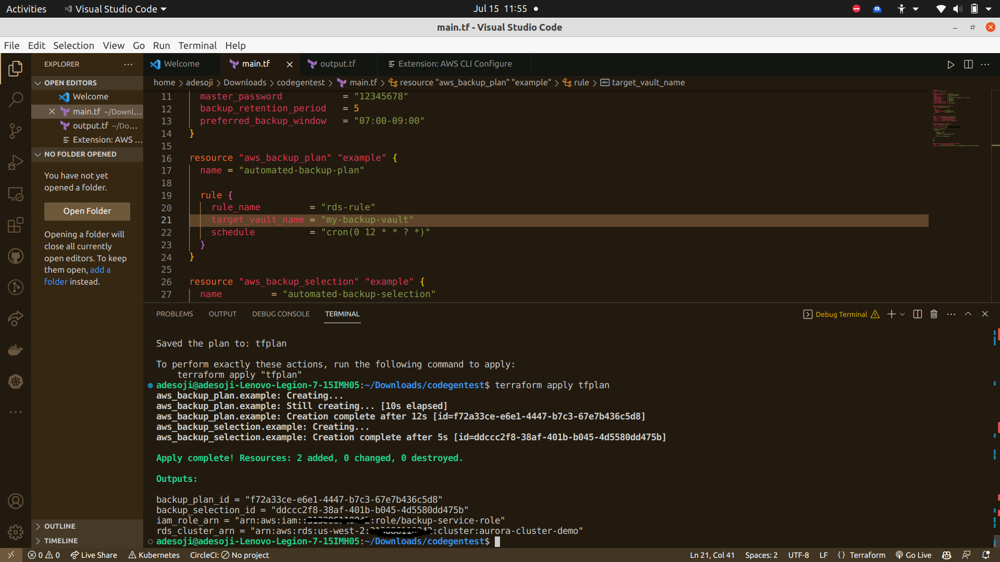

# Automated-RDS-Backup-and-Restore-Strategy

We need an automated backup strategy for our RDS instances to ensure business continuity.
see the heaading ⬆️ for emphasis.
 
😄  Happy read. Folder <a name="here"></a> [V1](./v1/main.tf)  and the default terraform scripts in this parent directory works without any error.✔️

✔️

## Terraform README

This README provides an overview of the approach, execution, prerequisites, cleanup steps, challenges faced, and design choices made during the execution of the Terraform task.

### Approach

The approach for this Terraform task was to define the infrastructure resources required for an RDS Aurora cluster with backup and recovery capabilities. The task involved creating a VPC, subnets, security group, DB subnet group, KMS key, RDS cluster, RDS instances, Secrets Manager secret, backup vault, backup plan, backup selection, IAM role, and IAM role policy attachment.

The Terraform scripts were structured into logical sections, including provider configuration, data sources, resource definitions, module usage, and output definitions. The required variables were declared and referenced appropriately. The execution of the task involved running terraform init to initialize the working directory and then running terraform apply to create the infrastructure resources.

### Restore Strategies

1. Manually restoring a Db from a Snapshot inside an aws console
2. Using Ansible. Ansible: This is a powerful automation tool that can manage AWS resources (among many others) using its easy-to-read YAML syntax. <a name="here"></a> [click here](./Restore_strategy/ansible_instructions.md) but we are focusing only on terraform .
3. Running a bash script <a name="here"></a> [here](./Restore_strategy/execute_s3_script.sh) with the  instructions <a name="here"></a> [here](./Restore_strategy/instruction_for_restore_snapshot_py.md)
4. Create an RDS instance for the staging environment by restoring the latest snapshot of the production environment <a name="here"></a> [click here](./staging_environment/Readme.md) for implementation instructions

5. Using Aws Lambda function.(Not Implemented yet)

### Prerequisites

To execute the Terraform scripts, the following prerequisites should be in place:

1. Terraform should be installed on the local machine.
2. AWS credentials with appropriate permissions should be configured.
3. ccess to the AWS region specified in the Terraform scripts should be available.

#### Cleanup Steps

To clean up the infrastructure resources created by the Terraform scripts, follow these steps:

1. Open a terminal or command prompt.
2. Navigate to the directory containing the Terraform scripts.
3. Run the command `terraform destroy `to destroy all the resources created by Terraform.
4. Confirm the destruction by typing "yes" when prompted.

#### Challenges Faced and Solutions

During the execution of the task, the following challenges were faced and addressed:

1. Undeclared Input Variables: The error message "Reference to undeclared input variable" occurred when referencing variables that were not declared. To resolve this, the missing variables were added to the variables declaration block in the Terraform script.

2. Dependency Ordering: Some resources had dependencies on others, causing dependency ordering issues during the Terraform execution. The depends_on attribute was used to explicitly define the dependencies between resources, ensuring the correct ordering.

#### Design and Technology Choices

The design and technology choices made during the task include:

1. Infrastructure as Code: Terraform was chosen as the Infrastructure as Code (IaC) tool to provision and manage the AWS resources. It provides a declarative approach to infrastructure provisioning, making it easier to define and maintain the desired state of the infrastructure.

2. AWS Provider: The AWS provider was selected to interact with AWS services and resources. It offers a wide range of resources and configuration options, enabling the provisioning of AWS infrastructure using Terraform.

3. Modularization: The Terraform scripts were organized into modules to promote reusability and maintainability. The modules were used to encapsulate related resources and provide a clean and modular structure to the Terraform code.

4. Backup and Recovery: The backup and recovery strategy for the RDS Aurora cluster involved enabling automated backups with a retention period, defining a backup window, exporting logs to CloudWatch, creating a backup vault, setting up a backup plan, and associating the cluster with the plan. These choices ensure regular backups and enable point-in-time recovery. To restore a snapshot, you can either use the AWS Management Console or the AWS CLI. Manually restoring a snapshot via the AWS Console or CLI involves selecting the snapshot and initiating the restoration process. Once the restoration is complete, you can modify the Terraform script to include the newly restored instance if needed.

5. Alternatively, you can automate the snapshot restoration process using the AWS CLI or SDKs within a separate script outside of Terraform, and then use Terraform to manage the infrastructure based on the restored snapshot . A terraform.sh script is located
 <a name="here"></a> [here](./Restore_strategy/restore_snapshot.sh) 

By following these design and technology choices, the Terraform scripts provide a scalable and manageable approach to provisioning an RDS Aurora cluster with backup and recovery capabilities.

For any further questions or clarifications, please feel free to email me at adesoji.alu@gmail.com 


### Docs  💡

The terraform document  specified here is version 3.76.1 which was released 6 months ago 

## Authentication 🔒

The AWS provider offers a flexible means of providing credentials for authentication. The following methods are supported, in this order, and explained ⬇️:

- Static credentials
- Environment variables
- Shared credentials/configuration file
- CodeBuild, ECS, and EKS Roles
- EC2 Instance Metadata Service (IMDS and IMDSv2)

For this task, Environment variable was used, look ⬇️ to configure using the command for your OS. in addition, execute your environment variables in the working directory where your terraform scripts are defined and initialized.

### Linux/Mac: 💻

```console markdown
export TF_VAR_db_password="your_secret_password"

```

### Windows (PowerShell): 💻

```console markdown
$env:TF_VAR_db_password="your_secret_password"


```

 login into your aws console and navigate to the commandline interface to obtain "Get credentials for AdministratorAccess"


```console markdown
export AWS_ACCESS_KEY_ID="xxxxxxxxxxxxxxxxxxxxx"
export AWS_SECRET_ACCESS_KEY="xxxxxxxxxxxxxxxxxx"
export AWS_SESSION_TOKEN="xxxxxxxxxxxxxxxxxxxxxxxxxxxxxx"

```

in your CLI, cick on the copy icon under the : Set AWS environment variables (Short-term credentials) and paste in your terraform task path or directory cli environment. the command is seen above

Having done the above, run this command ⬇️ to verify you are logged into your aws and you can view your default IAM Role.


```console markdown
aws sts get-caller-identity

```
This output a value ⬇️ like this

{
    "UserId": "xxxxxxxxxxxxx",
    "Account": "xxxxxxxxxxxx",
    "Arn": "arn:aws:sts::xxxxxxxx:assumed-role/AWsxxxxxxxx_xxxxxxxx/xxxxxx
}

If you see the above, that means you have successfully validated your aws cli credentials.


Next, we install Terraform.  ℹ️ 
## Usage

Install Terraform : [here](https://developer.hashicorp.com/terraform/tutorials/aws-get-started/install-cli) by selecting your appropriate OS (Windows,Linux or Mac)

To run this example you need to execute these commands ⬇️:

```bash
$ terraform validate
$ terraform init
$ terraform plan -out=tfplan
$ terraform apply tfplan
```


```console markdown
terraform validate

```

```console markdown
terraform init

```

This command ⬇️ creates a backupvault

```console markdown
aws backup create-backup-vault --backup-vault-name my-backup-vault1 --region your-region

```

***Optional** ℹ️ or ❌


Delete a backup, run  the command ⬇️ but ensure you have IAM role that governs that.

```console markdown
aws backup delete-backup-vault --backup-vault-name my-backup-vault1 --region your-region

```

Run the following command to list the backup vaults:

```console markdown

aws backup list-backup-vaults

```

proceed to apply the plan configuration running the command ⬇️:


```console markdown
terraform plan -out=tfplan

```

running this command ➡️ terraform plan -out=tfplan will generate similar results on your cli ⬇️

data.aws_caller_identity.current: Reading...

aws_ebs_volume.example: Refreshing state... [id=vol-03cbaa4f25efa1d6e]

aws_ebs_snapshot.example_snapshot: Refreshing state... [id=snap-05e219977c26803d8]

aws_iam_role.example: Refreshing state... [id=backup-service-role]

aws_backup_plan.example: Refreshing state... [id=xxxxxxxxxxxxxxxxxxxxxxxxx]

aws_rds_cluster.example: Refreshing state... [id=aurora-cluster-demo]

data.aws_caller_identity.current: Read complete after 1s [id=xxxxxxxxxxxxx]

aws_iam_role_policy_attachment.example: Refreshing state... 

[id=backup-service-role-xxxxxxxxxxxxxxxx]

Note: Objects have changed outside of Terraform

Terraform detected the following changes made outside of Terraform since the last "terraform apply" which may have affected this plan:

  # aws_rds_cluster.example has been deleted

  - resource "aws_rds_cluster" "example" {
   - arn     = "arn:aws:rds:us-west-2:313086110842:cluster:aurora-cluster-demo" -> null
   - cluster_identifier   = "aurora-cluster-demo" -> null
  - endpoint = "aurora-cluster-demo.cluster-cor148byukid.us-west-2.rds.amazonaws.com" -> null
  - id = "aurora-cluster-demo" -> null
        tags = {}
       
        #(30 unchanged attributes hidden)
    }


Unless you have made equivalent changes to your configuration, or ignored the relevant attributes using ignore_changes, the following plan
may include actions to undo or respond to these changes.

────────────────────────────────────────────────────────────────────────────────────────────────────────────────────────────────────────────

Terraform used the selected providers to generate the following execution plan. Resource actions are indicated with the following symbols:
 + create   ~ update in-place

Terraform will perform the following actions:

  # aws_backup_plan.example will be updated in-place

  ~ resource "aws_backup_plan" "example" {
        id       = "f72a33ce-e6e1-4447-b7c3-67e7b436c5d8"
        name     = "automated-backup-plan"
        tags     = {}
        # (3 unchanged attributes hidden)

      - rule {
          - completion_window        = 180 -> null
          - enable_continuous_backup = false -> null
          - recovery_point_tags      = {} -> null
          - rule_name                = "rds-rule" -> null
          - schedule                 = "cron(0 12 * * ? *)" -> null
          - start_window             = 60 -> null
          - target_vault_name        = "my-backup-vault" -> null
        }
      + rule {
          + completion_window        = 180
          + enable_continuous_backup = false
          + rule_name                = "rds-rule"
          + schedule                 = "cron(0 12 * * ? *)"
          + start_window             = 60
          + target_vault_name        = "newhot-backup-demo"
        }
    }

  # aws_backup_selection.example will be created

  + resource "aws_backup_selection" "example" {
      + iam_role_arn  = "arn:aws:iam::313086110842:role/backup-service-role"
      + id            = (known after apply)
      + name          = "automated-backup-selection"
      + not_resources = (known after apply)
      + plan_id       = "f72a33ce-e6e1-4447-b7c3-67e7b436c5d8"
      + resources     = (known after apply)
    }

  # aws_backup_vault.example will be created

  + resource "aws_backup_vault" "example" {
      + arn             = (known after apply)
      + id              = (known after apply)
      + kms_key_arn     = (known after apply)
      + name            = "newhot-backup-demo"
      + recovery_points = (known after apply)
      + tags_all        = (known after apply)
    }

  # aws_db_snapshot.example will be created

  + resource "aws_db_snapshot" "example" {
      + allocated_storage             = (known after apply)
      + availability_zone             = (known after apply)
      + db_instance_identifier        = "aurora-cluster-demo"
      + db_snapshot_arn               = (known after apply)
      + db_snapshot_identifier        = "aurora-cluster-demo-snapshot"
      + encrypted                     = (known after apply)
      + engine                        = (known after apply)
      + engine_version                = (known after apply)
      + id                            = (known after apply)
      + iops                          = (known after apply)
      + kms_key_id                    = (known after apply)
      + license_model                 = (known after apply)
      + option_group_name             = (known after apply)
      + port                          = (known after apply)
      + snapshot_type                 = (known after apply)
      + source_db_snapshot_identifier = (known after apply)
      + source_region                 = (known after apply)
      + status                        = (known after apply)
      + storage_type                  = (known after apply)
      + tags_all                      = (known after apply)
      + vpc_id                        = (known after apply)
    }

  # aws_db_subnet_group.example will be created
  + resource "aws_db_subnet_group" "example" {
      + arn         = (known after apply)
      + description = "Managed by Terraform"
      + id          = (known after apply)
      + name        = "main"
      + name_prefix = (known after apply)
      + subnet_ids  = (known after apply)
      + tags        = {
          + "Name" = "My database subnet group"
        }
      + tags_all    = {
          + "Name" = "My database subnet group"
        }
    }

  # aws_kms_key.example will be created
  + resource "aws_kms_key" "example" {
      + arn                                = (known after apply)
      + bypass_policy_lockout_safety_check = false
      + customer_master_key_spec           = "SYMMETRIC_DEFAULT"
      + deletion_window_in_days            = 10
      + description                        = "KMS key for RDS cluster"
      + enable_key_rotation                = false
      + id                                 = (known after apply)
      + is_enabled                         = true
      + key_id                             = (known after apply)
      + key_usage                          = "ENCRYPT_DECRYPT"
      + multi_region                       = (known after apply)
      + policy                             = (known after apply)
      + tags_all                           = (known after apply)
    }

  # aws_rds_cluster.example will be created
  + resource "aws_rds_cluster" "example" {
      + apply_immediately                   = true
      + arn                                 = (known after apply)
      + availability_zones                  = [
          + "us-west-2a",
          + "us-west-2b",
        ]
      + backup_retention_period             = 5
      + cluster_identifier                  = "aurora-cluster-demo"
      + cluster_identifier_prefix           = (known after apply)
      + cluster_members                     = (known after apply)
      + cluster_resource_id                 = (known after apply)
      + copy_tags_to_snapshot               = false
      + database_name                       = "postgres"
      + db_cluster_parameter_group_name     = (known after apply)
      + db_subnet_group_name                = "main"
      + deletion_protection                 = true
      + enable_global_write_forwarding      = false
      + enable_http_endpoint                = false
      + enabled_cloudwatch_logs_exports     = [
          + "postgresql",
        ]
      + endpoint                            = (known after apply)
      + engine                              = "aurora-postgresql"
      + engine_mode                         = "provisioned"
      + engine_version                      = "13.7"
      + engine_version_actual               = (known after apply)
      + hosted_zone_id                      = (known after apply)
      + iam_database_authentication_enabled = true
      + iam_roles                           = (known after apply)
      + id                                  = (known after apply)
      + kms_key_id                          = (known after apply)
      + master_password                     = (sensitive value)
      + master_username                     = "postgres"
      + port                                = (known after apply)
      + preferred_backup_window             = "07:00-09:00"
      + preferred_maintenance_window        = (known after apply)
      + reader_endpoint                     = (known after apply)
      + skip_final_snapshot                 = false
      + storage_encrypted                   = true
      + tags_all                            = (known after apply)
      + vpc_security_group_ids              = (known after apply)
    }

  # aws_rds_cluster_instance.example[0] will be created
  + resource "aws_rds_cluster_instance" "example" {
      + apply_immediately                     = (known after apply)
      + arn                                   = (known after apply)
      + auto_minor_version_upgrade            = true
      + availability_zone                     = (known after apply)
      + ca_cert_identifier                    = (known after apply)
      + cluster_identifier                    = (known after apply)
      + copy_tags_to_snapshot                 = false
      + db_parameter_group_name               = (known after apply)
      + db_subnet_group_name                  = (known after apply)
      + dbi_resource_id                       = (known after apply)
      + endpoint                              = (known after apply)
      + engine                                = "aurora-postgresql"
      + engine_version                        = "13.7"
      + engine_version_actual                 = (known after apply)
      + id                                    = (known after apply)
      + identifier                            = "aurora-cluster-demo-0"
      + identifier_prefix                     = (known after apply)
      + instance_class                        = "db.r4.large"
      + kms_key_id                            = (known after apply)
      + monitoring_interval                   = 0
      + monitoring_role_arn                   = (known after apply)
      + performance_insights_enabled          = (known after apply)
      + performance_insights_kms_key_id       = (known after apply)
      + performance_insights_retention_period = (known after apply)
      + port                                  = (known after apply)
      + preferred_backup_window               = (known after apply)
      + preferred_maintenance_window          = (known after apply)
      + promotion_tier                        = 0
      + publicly_accessible                   = false
      + storage_encrypted                     = (known after apply)
      + tags_all                              = (known after apply)
      + writer                                = (known after apply)
    }

  # aws_rds_cluster_instance.example[1] will be created
  + resource "aws_rds_cluster_instance" "example" {
      + apply_immediately                     = (known after apply)
      + arn                                   = (known after apply)
      + auto_minor_version_upgrade            = true
      + availability_zone                     = (known after apply)
      + ca_cert_identifier                    = (known after apply)
      + cluster_identifier                    = (known after apply)
      + copy_tags_to_snapshot                 = false
      + db_parameter_group_name               = (known after apply)
      + db_subnet_group_name                  = (known after apply)
      + dbi_resource_id                       = (known after apply)
      + endpoint                              = (known after apply)
      + engine                                = "aurora-postgresql"
      + engine_version                        = "13.7"
      + engine_version_actual                 = (known after apply)
      + id                                    = (known after apply)
      + identifier                            = "aurora-cluster-demo-1"
      + identifier_prefix                     = (known after apply)
      + instance_class                        = "db.r4.large"
      + kms_key_id                            = (known after apply)
      + monitoring_interval                   = 0
      + monitoring_role_arn                   = (known after apply)
      + performance_insights_enabled          = (known after apply)
      + performance_insights_kms_key_id       = (known after apply)
      + performance_insights_retention_period = (known after apply)
      + port                                  = (known after apply)
      + preferred_backup_window               = (known after apply)
      + preferred_maintenance_window          = (known after apply)
      + promotion_tier                        = 0
      + publicly_accessible                   = false
      + storage_encrypted                     = (known after apply)
      + tags_all                              = (known after apply)
      + writer                                = (known after apply)
    }

  # aws_secretsmanager_secret.db_password will be created
  + resource "aws_secretsmanager_secret" "db_password" {
      + arn                            = (known after apply)
      + force_overwrite_replica_secret = false
      + id                             = (known after apply)
      + name                           = "DB_PASSWORD"
      + name_prefix                    = (known after apply)
      + policy                         = (known after apply)
      + recovery_window_in_days        = 30
      + rotation_enabled               = (known after apply)
      + rotation_lambda_arn            = (known after apply)
      + tags_all                       = (known after apply)
    }

  # aws_secretsmanager_secret_version.db_password will be created
  + resource "aws_secretsmanager_secret_version" "db_password" {
      + arn            = (known after apply)
      + id             = (known after apply)
      + secret_id      = (known after apply)
      + secret_string  = (sensitive value)
      + version_id     = (known after apply)
      + version_stages = (known after apply)
    }

  # aws_security_group.example will be created
  + resource "aws_security_group" "example" {
      + arn                    = (known after apply)
      + description            = "Example security group"
      + egress                 = [
          + {
              + cidr_blocks      = [
                  + "0.0.0.0/0",
                ]
              + description      = ""
              + from_port        = 0
              + ipv6_cidr_blocks = []
              + prefix_list_ids  = []
              + protocol         = "-1"
              + security_groups  = []
              + self             = false
              + to_port          = 0
            },
        ]
      + id                     = (known after apply)
      + ingress                = [
          + {
              + cidr_blocks      = [
                  + "10.0.0.0/16",
                ]
              + description      = "TLS from VPC"
              + from_port        = 0
              + ipv6_cidr_blocks = []
              + prefix_list_ids  = []
              + protocol         = "-1"
              + security_groups  = []
              + self             = false
              + to_port          = 0
            },
        ]
      + name                   = "example"
      + name_prefix            = (known after apply)
      + owner_id               = (known after apply)
      + revoke_rules_on_delete = false
      + tags_all               = (known after apply)
      + vpc_id                 = (known after apply)
    }

  # aws_subnet.main will be created
  + resource "aws_subnet" "main" {
      + arn                                            = (known after apply)
      + assign_ipv6_address_on_creation                = false
      + availability_zone                              = "us-west-2a"
      + availability_zone_id                           = (known after apply)
      + cidr_block                                     = "10.0.1.0/24"
      + enable_dns64                                   = false
      + enable_resource_name_dns_a_record_on_launch    = false
      + enable_resource_name_dns_aaaa_record_on_launch = false
      + id                                             = (known after apply)
      + ipv6_cidr_block_association_id                 = (known after apply)
      + ipv6_native                                    = false
      + map_public_ip_on_launch                        = false
      + owner_id                                       = (known after apply)
      + private_dns_hostname_type_on_launch            = (known after apply)
      + tags_all                                       = (known after apply)
      + vpc_id                                         = (known after apply)
    }

  # aws_subnet.secondary will be created
  + resource "aws_subnet" "secondary" {
      + arn                                            = (known after apply)
      + assign_ipv6_address_on_creation                = false
      + availability_zone                              = "us-west-2b"
      + availability_zone_id                           = (known after apply)
      + cidr_block                                     = "10.0.2.0/24"
      + enable_dns64                                   = false
      + enable_resource_name_dns_a_record_on_launch    = false
      + enable_resource_name_dns_aaaa_record_on_launch = false
      + id                                             = (known after apply)
      + ipv6_cidr_block_association_id                 = (known after apply)
      + ipv6_native                                    = false
      + map_public_ip_on_launch                        = false
      + owner_id                                       = (known after apply)
      + private_dns_hostname_type_on_launch            = (known after apply)
      + tags_all                                       = (known after apply)
      + vpc_id                                         = (known after apply)
    }

  # aws_vpc.main will be created
  + resource "aws_vpc" "main" {
      + arn                                  = (known after apply)
      + cidr_block                           = "10.0.0.0/16"
      + default_network_acl_id               = (known after apply)
      + default_route_table_id               = (known after apply)
      + default_security_group_id            = (known after apply)
      + dhcp_options_id                      = (known after apply)
      + enable_classiclink                   = (known after apply)
      + enable_classiclink_dns_support       = (known after apply)
      + enable_dns_hostnames                 = (known after apply)
      + enable_dns_support                   = true
      + id                                   = (known after apply)
      + instance_tenancy                     = "default"
      + ipv6_association_id                  = (known after apply)
      + ipv6_cidr_block                      = (known after apply)
      + ipv6_cidr_block_network_border_group = (known after apply)
      + main_route_table_id                  = (known after apply)
      + owner_id                             = (known after apply)
      + tags_all                             = (known after apply)
    }

Plan: 14 to add, 1 to change, 0 to destroy.

Changes to Outputs:
  + aws_backup_plan_id        = "f72a33ce-e6e1-4447-b7c3-67e7b436c5d8"
  + aws_backup_selection_id   = (known after apply)
  + aws_backup_vault_arn      = (known after apply)
  + aws_db_snapshot_id        = (known after apply)
  + aws_iam_role_arn          = "arn:aws:iam::313086110842:role/backup-service-role"
  + aws_rds_cluster_endpoint  = (known after apply)
  + aws_rds_cluster_id        = (known after apply)
  + aws_rds_cluster_instances = [
      + (known after apply),
      + (known after apply),
    ]
  + aws_security_group_id     = (known after apply)
  + aws_subnet_ids            = [
      + (known after apply),
      + (known after apply),
    ]
  + aws_vpc_id                = (known after apply)
  + db_subnet_group_name      = "main"

────────────────────────────────────────────────────────────────────────────────────────────────────────────────────────────────────────────

Saved the plan to: tfplan

To perform exactly these actions, run the following command to apply:
    terraform apply "tfplan"

Next step is to run the command ⬇️


```console markdown
terraform apply tfplan

```


Note that this example may create resources which cost money. Run `terraform destroy` when you don't need these resources.

<!-- BEGINNING OF PRE-COMMIT-TERRAFORM DOCS HOOK -->
## Requirements ⚠️

| Name | Version |
|------|---------|
| <a name="requirement_terraform"></a> [terraform](#requirement\_terraform) | >= 0.13 |
| <a name="requirement_aws"></a> [aws](#requirement\_aws) | >= 3.00 |

## Providers ⚠️

| Name | Version |
|------|---------|
| <a name="provider_aws"></a> [aws](#provider\_aws) | >= 3.00 |

## Resources 🔧

| Name | Type |
|------|------|
| [aws_vpc](https://registry.terraform.io/providers/hashicorp/aws/3.76.1/docs/resources/vpc) | resource |
| [aws_caller_identity.current](https://registry.terraform.io/providers/hashicorp/aws/3.76.1/docs/data-sources/caller_identity) | data source | 
| [aws_subnet](https://registry.terraform.io/providers/hashicorp/aws/3.76.1/docs/resources/subnet) | resource |
| [aws_security_group](https://registry.terraform.io/providers/hashicorp/aws/3.76.1/docs/resources/security_group) | resource |
| [aws_db_subnet_group](https://registry.terraform.io/providers/hashicorp/aws/3.76.1/docs/resources/db_subnet_group) | resource |
| [aws_rds_cluster](https://registry.terraform.io/providers/hashicorp/aws/3.76.1/docs/resources/ds_cluster_instance) | resource |
| [aws_rds_cluster_instance](https://registry.terraform.io/providers/hashicorp/aws/3.76.1/docs/resources/ds_cluster_instance) | resource |
| [aws_secretsmanager_secret](https://registry.terraform.io/providers/hashicorp/aws/3.76.1/docs/resources/secretsmanager_secret)| resource |
| [aws_backup_vault](https://registry.terraform.io/providers/hashicorp/aws/3.76.1/docs/resources/backup_vault) | resource |
| [aws_backup_plan](https://registry.terraform.io/providers/hashicorp/aws/3.76.1/docs/resources/backup_plan) | resource |
| [aws_secretsmanager_secret_version](https://registry.terraform.io/providers/hashicorp/aws/3.76.1/docs/resources/secretsmanager_secret_version) | resource |
| [aws_backup_selection](https://registry.terraform.io/providers/hashicorp/aws/3.76.1/docs/resources/backup_selection)| resource |
| [aws_iam_role](https://registry.terraform.io/providers/hashicorp/aws/3.76.1/docs/resources/iam_role) | resource |
| [aws_db_snapshot](https://registry.terraform.io/providers/hashicorp/aws/3.76.1/docs/resources/db_snapshot) | resource |


### Inputs 📊

|	Serial No	|	Tool Name	|		Description 	|	Variable Representation
| ---------- | --------------------- | --------------------- | ------------------ |
|	1	|  `var.engine_version` |  A variable representing the engine version for the RDS cluster  | var |
| 2 | `var.db_password` | A variable representing the password for the RDS master user  |  var|
| 3 | `${var.engine_version}` and `${var.db_password}`| These input variables are referenced in the script using interpolation syntax| var |


### Outputs   📊


|	Serial No	|	Tool Name	|		Description 	|	.
| ---------- | --------------------- | --------------------- | ------------------ |
|	1	|  `aws_rds_cluster.example.endpoint`| The endpoint URL of the RDS cluster  | 
| 2 | `aws_backup_vault.example.arn` | The ARN of the created AWS Backup vault  |  
|	3	|  `aws_backup_plan.example.id` |  The ID of the created AWS Backup plan  | 
| 4 | `var.db_password` | A variable representing the password for the RDS master user  | 
|	5	|  `aws_rds_cluster.example.endpoint`| The endpoint URL of the RDS cluster  | 
| 6 | `aws_backup_vault.example.arn` | The ARN of the created AWS Backup vault  |  
|	7	|  `aws_backup_plan.example.id` |  The ID of the created AWS Backup plan  | 
| 8 | `var.db_password` | A variable representing the password for the RDS master user  | 


## Outputs 📊

These outputs are displayed when terraform apply tfplan is succesful as seen in the image . ⬇️




| Name | Description |
|------|-------------|
| <a name="output_aws_vpc_id"></a>[aws_vpc_id](./output.tf#L1) | The Vpc id is displayed in your terminal |
| <a name="output_aws_subnet_ids"></a> [aws_subnet_ids](./output.tf#L6) | The Subnet Id's are displayed in your terminal |
| <a name="output_aws_backup_vault_arn"></a> [aws_backup_vault_arn](./output.tf#L41) | The ARN of the backup vault |
| <a name="output_aws_rds_cluster_instances"></a> [aws_rds_cluster_instances](./output.tf#L26) | The identifiers of the RDS Cluster instances |
| <a name="output_aws_rds_cluster_endpoint"></a> [aws_rds_cluster_endpoint](./output.tf#L31) | The connection endpoint for the RDS Cluster |
| <a name="output_aws_security_group_id"></a> [aws_security_group_id](./output.tf#L11) | The aws security group id |

If you want to view the value of a specific output variable, you can use the following command:


 `terraform output`  command or by querying the <a name="Terraform state file"></a> [terraform.tfstate](./terraform.tfstate) 

Please note that the inputs and outputs may vary depending on the specific requirements of your environment and infrastructure setup. It's essential to review and customize the inputs and outputs based on your needs.


<!-- END OF PRE-COMMIT-TERRAFORM DOCS HOOK -->

